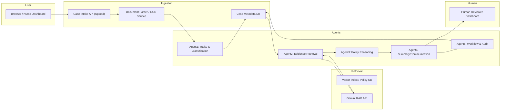

# Executive Summary

The ElevanceHealth Prior Authorization Evidence Assistant is an AI-enabled system designed to streamline payer prior authorization workflows.  It accepts uploaded case documents (referrals, clinical notes, policy PDFs, etc.), uses Retrieval-Augmented Generation (RAG) to fetch relevant policy and evidence, and assists human reviewers with summaries and missing-document checks.  We adopt a **Spec-Driven Development (SSD)** approach using GitHub’s Spec-Kit (“Speckit”) framework to structure the build process.  At each SSD phase we define clear **purpose, inputs, outputs, and acceptance criteria**; we craft targeted Speckit commands and Google Gemini prompts; and we specify API contracts, UI prompts, test cases, error handling, observability, and deployment.  For RAG, we use Google’s Gemini Enterprise Agent API (Vertex AI) to retrieve and incorporate evidence.  We compare alternative RAG strategies (e.g. simple vs. hybrid retrieval) and prompt designs, and we provide example JSON API schemas and test matrices.  Diagrams (Mermaid) illustrate data flow and component interactions. 

Key highlights:

- **Requirements and Context:**  The supplied ElevanceHealth spec defines a five-agent pipeline (Intake, Evidence Retrieval, Policy Reasoning, Summary, Workflow/Audit).  In-scope features include document upload, OCR, metadata extraction, RAG-based evidence lookup, missing-info detection, nurse-dashboard, and audit logging.  We summarize these requirements and scope points to ground our design.  
- **Spec-Kit (Speckit) Workflow:**  We follow Speckit’s prescribed multi-step process.  We begin by establishing a **constitution** (coding standards, data privacy rules) via `/speckit.constitution`.  Then we write a high-level **specification** (`/speckit.specify`) outlining the application’s features from the ElevanceHealth spec (e.g. “Build a system that ingests prior-auth requests, verifies required documents, and retrieves relevant policy citations”).  We use `/speckit.clarify` to resolve ambiguities in the spec.  Next, `/speckit.plan` is used to choose the tech stack (e.g. cloud-hosted microservices, vector DB) and sketch the architecture.  We break the implementation into tasks with `/speckit.tasks`, and finally execute the tasks with `/speckit.implement`.  Each step’s Speckit command is accompanied by a prompt template.  
- **Gemini RAG Integration:**  For document verification and evidence lookup, we design Gemini (Vertex AI) RAG prompts.  For example, to check for missing documents we might use a prompt like *“You are a healthcare assistant. Given the case details and uploaded files, list any missing required documents and cite relevant policy sections.”*; for evidence retrieval: *“You are a clinical reviewer. Based on the retrieved policy passages below and the patient’s case, answer: Which clinical evidence supports the authorization request?”*  In practice we will call Gemini’s RAG APIs (e.g. `askContexts`).  
- **API Contracts & UI:** We define RESTful endpoints such as **`POST /api/cases/upload`** (to submit case data and files) and **`GET /api/cases/{id}/evidence`** (to query evidence).  Example JSON request/response schemas are provided.  UI interaction flows are described (e.g. an upload form, dashboard screens for nurse reviewers).  
- **Testing:** We specify unit, integration, and end-to-end test cases.  For instance, unit tests validate PDF parsing, OCR, and metadata extraction; integration tests cover the complete intake pipeline; E2E tests simulate a user uploading documents and asking questions, expecting correct missing-doc detection and summarization.  A test matrix outlines coverage of components vs. scenarios.  
- **Observability & Deployment:** We incorporate logging of prompts, responses, citation metadata, and confidence scores.  Metrics like *Time-to-First-Token* and grounding accuracy are tracked.  We plan alerts on errors (e.g. failed OCR or low retrieval quality).  Deployment will likely target a cloud platform (e.g. Google Cloud) using containers or managed services for scalability.  We note that authentication and hosting were unspecified in the spec, so we assume standard API auth (OAuth or API keys) and cloud deployment.  

The remainder of this report details each SSD phase and component with full technical specificity, citing authoritative sources on Spec-Driven Development, RAG, and the Gemini API throughout.

## Requirements and Context

From the provided ElevanceHealth spec document, we extract the following key requirements and scope:

- **Use Case:** Build a *Prior Authorization Evidence Assistant* for a health insurer.  The system must ingest provider prior-auth requests (PDFs, scanned forms, referral letters, etc.) and help reviewers by verifying completeness and retrieving evidence.
- **Business Context:** Payers receive high volumes of prior-auth requests. Each request comes with member demographics, provider notes, diagnosis/procedure codes, benefit rules, prior authorizations, and attachments (images/PDFs). Manual review is slow and error-prone.
- **Core Objectives:** Using RAG and multi-agent LLMs (Google Gemini), assist human reviewers by answering questions like:
  - *“What clinical evidence supports this request?”*  
  - *“Which policy sections apply?”*  
  - *“Is any required document missing?”*  
  - *“Summarize this case for nurse review.”*  
  - *“Generate a reviewer checklist.”*  
- **In-Scope Features:**  
  - Case ingestion API/UI for uploading documents (with placeholder OCR integration)  
  - Metadata extraction (member ID, provider ID, diagnosis code, etc.)  
  - RAG-based retrieval from policy documents and case files  
  - 5 specialized agents (Intake & Classification, Evidence Retrieval, Policy Reasoning, Summary/Communication, Workflow & Audit) as outlined in the spec  
  - Missing-document detection, case summarization, policy evidence mapping  
  - Human-in-the-loop review dashboard (for nurses or medical directors) with audit logging  
  - Automated test generation (driven by Speckit specifications)  
- **Out of Scope:** Automated denial/approval, final clinical decisions, real PHI in dev, payment/claims adjudication.

These extracted requirements drive our SSD design.  For example, the **Intake Agent** will trigger on document upload; the **Evidence Retrieval Agent** uses RAG on stored policy corpora; the **Policy Reasoning Agent** compares facts to policy; the **Summary Agent** generates human-readable outputs; and the **Workflow Agent** logs metadata and routes tasks.

## Spec-Driven Development (Speckit) Workflow

Spec-Driven Development (SDD) with GitHub’s Spec-Kit (Speckit) is a multi-step process that emphasizes writing formal specifications before (and during) coding.  Speckit provides a CLI with commands like `/speckit.constitution`, `/speckit.specify`, `/speckit.plan`, `/speckit.tasks`, and `/speckit.implement`.  We follow this pipeline:

1. **Constitution:** Establish project principles and guidelines.  
2. **Specify:** Formally specify what the application should do (requirements, user stories).  
3. **Clarify (Optional):** Resolve any under-specified or ambiguous parts of the spec.  
4. **Plan:** Choose tech stack and design architecture.  
5. **Tasks:** Break the plan into actionable tasks.  
6. **Implement:** Execute the tasks to build the system.  

At each step, we document **purpose, inputs, outputs, acceptance criteria**, and supply example **Speckit prompts** and **Gemini prompts** as needed.  We also define any API contracts, UI prompts, test cases, error handling, observability hooks, and deployment considerations relevant to that phase.

Throughout this process, all LLM interactions (via Speckit or custom GPT calls) will use the Google Gemini API as the backend.

## Step 1: Constitution (Project Principles)

- **Purpose:** Define project-wide principles and constraints before writing any code. This ensures consistent decision-making on code quality, security, data privacy, and compliance throughout development.
- **Inputs:** Initial project idea; organizational standards (e.g. healthcare data policies).
- **Outputs:** `constitution.md` file listing principles. Example principles might include: “Use secure data handling (HIPAA compliance)”, “Write unit tests for all components”, “Use RESTful APIs”, “Prefer open-source libraries”, etc.
- **Acceptance Criteria:** Constitution file exists and covers at least data privacy, testing, documentation, and UI/UX guidelines. It is reviewed by stakeholders. 
- **Speckit Prompt Template:**  
  ```
  /speckit.constitution Create project principles for a healthcare AI app: emphasize data security, code quality, testing, and compliance. 
  ```
  (This aligns with the spec’s emphasis on auditability and security.)  
- **Gemini RAG Prompt Templates:** Not applicable at this stage.
- **API Contract:** N/A (this is pre-code).
- **UI Prompts:** N/A (foundational only).
- **Test Cases:** (Meta-check) Verify `constitution.md` was generated and includes key sections (e.g. data security, testing). 
- **Error Handling:** Speckit will report if constitution creation fails (e.g. invalid prompt).
- **Observability/Monitoring:** None specifically; but note that decisions here affect later observability (e.g. policy on logging). 
- **Deployment Considerations:** None at this phase.

## Step 2: Specify (Requirements Spec)

- **Purpose:** Formally define **what** to build, focusing on outcomes rather than implementation. The specification should capture all functional requirements, user stories, and high-level flows extracted from the ElevanceHealth document.
- **Inputs:** The ElevanceHealth use-case doc (business context, problem statement, scope, agent descriptions).
- **Outputs:** A `specs/` document (e.g. `specs/elevance-priorauth.md`) containing:
  - A summary of the app’s purpose (e.g. “Assist human reviewers by verifying required prior-auth documents and retrieving policy evidence”).
  - Detailed user stories, e.g.:  
    - *As a case reviewer, I can upload prior-auth documents and see a checklist of missing required forms.*  
    - *As a nurse, I can ask “What evidence supports this request?” and get a summarized answer with citations.*  
  - Acceptance criteria for each user story.
- **Acceptance Criteria:** The spec covers all items from the ElevanceHealth scope (document ingestion, OCR placeholder, metadata capture, RAG retrieval, multi-agent flows, dashboard, audit log, test automation).  It should explicitly list key questions the system must answer (as in the project objective).  It must be understandable to developers without external context.
- **Speckit Prompt Template:**  
  ```
  /speckit.specify Build a Prior Authorization Evidence Assistant based on the given use-case. Include functionality for uploading provider documents, checking required prior-auth forms, retrieving relevant policy sections, case summarization, and human review handoff.
  ```
  For example:  
  ```
  /speckit.specify Develop an application for ElevanceHealth that ingests prior-auth case data and documents. The app must identify missing required documents, search payer policy documents using RAG for clinical evidence, and present a summary to reviewers. 
  ```
- **Gemini RAG Prompt Templates:** N/A (RAG comes into play in implementation).
- **API Contract Examples:** We begin sketching key endpoints. For instance:  

  ```json
  // Request: Upload prior-auth case and documents
  POST /api/cases/upload
  {
    "memberId": "string",
    "providerId": "string",
    "diagnosisCode": "string",
    "procedureCode": "string",
    "serviceDate": "YYYY-MM-DD",
    "documents": [
      { "filename": "referral.pdf", "dataBase64": "..." },
      { "filename": "notes.txt", "dataBase64": "..." }
    ]
  }
  ---
  // Response: Case ingestion acknowledgement
  {
    "caseId": "case-12345",
    "status": "queued",
    "parsedFields": {
      "memberId": "string", "providerId": "string", ...
    },
    "missingDocsChecklist": ["referral", "imagingReport"]
  }
  ```
  
  ```json
  // Request: Retrieve evidence for a question on a case
  GET /api/cases/{caseId}/evidence?question=clinical_evidence
  ---
  // Response: Retrieved answer with citations
  {
    "answer": "The procedure is justified by policy section 7.3 on CPT code 99214, which states... [details]",
    "citations": [
      { "source": "MedicalPolicy.pdf", "page": 12, "line": 34 },
      { "source": "BenefitPlan2023", "page": null, "excerpt": "CPT 99214 requires documentation of chronic conditions." }
    ]
  }
  ```
  These are illustrative; actual fields will be refined later.
- **UI Interaction Prompts:** We outline initial UI flows: e.g.  
  - **Upload Screen:** Title “Upload Prior Authorization Documents”. Prompt text: “Select all relevant case documents (Referral, Imaging reports, Referral forms, etc.) and enter patient and request info.”  
  - **Case Dashboard:** After upload, show progress: “Analyzing your submission…”. Then display a checklist: “Missing Documents: [ X ] Referral Form, [✓] Imaging Report, [✓] Referral Note”.  Include a “Ask a question” text box for queries (“What evidence supports this request?”).  
  - **Reviewer Dashboard:** For a human reviewer, show summary cards and evidence tables as generated by agents.
- **Test Cases (spec-level):** We will write automated checks once spec is done. Early examples:  
  - Unit-test the spec generator (does `/speckit.specify` produce a non-empty spec file?).  
  - Check that all in-scope features from the doc appear in the spec file text.
- **Error Handling:** If speckit.specify fails or returns incomplete output, prompt the user to clarify the missing requirements.  
- **Observability/Monitoring:** Not yet applicable (planning stage). 
- **Deployment Considerations:** N/A at spec stage.

## Step 3: Clarify (Resolve Ambiguities)

- **Purpose:** Use `/speckit.clarify` to identify and resolve any under-specified details. This may involve asking targeted questions about the spec (e.g. what constitutes a “required document”, or how to classify requests).
- **Inputs:** The draft specification from Step 2.
- **Outputs:** `clarifications.md` with Q&A on open issues. For example:  
  - *Q: “What counts as a complete prior-auth submission?”*  
    *A: “It must include a referral form and imaging report as per policy checklists.”*  
  - *Q: “How to handle OCR failures?”* etc.
- **Acceptance Criteria:** All major uncertainties noted during planning are documented and answered. The spec should no longer have vague terms or missing definitions.
- **Speckit Prompt Template:**  
  ```
  /speckit.clarify Review the draft spec: what additional details are needed? (e.g. define 'missing documents', clarify output format) 
  ```
- **Gemini RAG Prompt Templates:** Still none specifically.
- **API Contract:** We might add clarifications (e.g. authentication) but likely left for later.
- **UI Prompts:** N/A.
- **Test Cases:** Verify that after clarification, the spec can stand alone (we might have an automated check like “no question marks or undefined terms in the spec”).
- **Error Handling:** Speckit will iteratively ask more questions if clarifications reveal more gaps.
- **Observability:** N/A.
- **Deployment:** N/A.

## Step 4: Plan (Architecture & Tech Stack)

- **Purpose:** Decide on the application’s architecture (microservices, data flow, tech choices) based on the spec.  Sketch component interactions.
- **Inputs:** Finalized spec/requirements, organizational constraints (not given explicitly, assume cloud-friendly tools).
- **Outputs:** Implementation plan document (`plan.md`) including:  
  - Chosen tech stack (e.g. backend in Python or Node.js; frontend in React; database for metadata; vector store like Pinecone or Databricks’ Mosaic for RAG).  
  - System architecture diagram (Mermaid).  
  - Description of each component/service.  
- **Acceptance Criteria:** The plan covers all spec features, with clear separation of concerns. For example, one service for case intake/parsing, one for RAG retrieval, one for UI, etc.  
- **Speckit Prompt Template:**  
  ```
  /speckit.plan Using Node.js/Express for the backend and React for the UI. Use a NoSQL database for case data and a vector store (e.g. Pinecone) for document embeddings. Deploy services in Docker on a Kubernetes cluster.
  ```
  Or more open-ended:  
  ```
  /speckit.plan Design a scalable microservices architecture for the Prior Auth Assistant. Include an API gateway, intake processor, RAG retrieval, and reviewer dashboard. Suggest cloud hosting.
  ```
- **Gemini RAG Prompt Templates:** N/A (except as architecture example, see below).
- **API Contracts:** Refine endpoint designs from Step 2. We may draft additional APIs (e.g. `/api/cases/{id}/missing-docs`), specifying request/response JSON.  
- **UI Prompts:** Possibly draw UI wireframes or list components. For example, “The dashboard should show sections for ‘Case Overview’, ‘Missing Documents’, ‘Policy Evidence’, and an ‘Ask a Question’ panel.”  
- **Test Cases:** Outline testing strategy aligned with architecture. For example, if using microservices, we need integration tests between services.  
- **Error Handling:** Plan for retries/compensations between services (e.g. if RAG retrieval fails, the case should log an exception and proceed to human review with a note).  
- **Observability:** Identify metrics:  
  - **Latency:** time to process a case (including OCR, RAG calls).  
  - **Success Rates:** e.g. percentage of successful retrievals.  
  - **Failures:** count of missing documents flagged incorrectly vs correctly.  
  - Incorporate structured logging at service boundaries.  
- **Deployment Considerations:**  
  - **Containerization:** Each service in Docker.  
  - **Cloud Services:** Use Google Cloud (Vertex AI for Gemini, Cloud Run or GKE for services, Cloud Functions or Pub/Sub for triggers).  Vertex AI integration suggests GCP.  
  - **CI/CD Pipeline:** Automated via GitHub Actions or similar; full automation of Speckit commands in CI.  

**Mermaid Architecture Diagram:** (components and data flow)



This diagram shows the case intake flow through the agents to the human reviewer.  (Arrows indicate data flow between components.)

## Step 5: Tasks (Breakdown)

- **Purpose:** Break down the plan into concrete development tasks.  Each task should map to implementing a piece of functionality (e.g. “Implement PDF parsing”, “Set up Pinecone vector DB”, “Develop `/api/cases/upload` endpoint”).  These tasks will drive the `/speckit.implement` stage.
- **Inputs:** Architecture plan, chosen libraries, any starter code (Speckit init will have bootstrapped the repo).
- **Outputs:** `tasks.md` with an ordered list of tasks. Example task entries might include:  
  1. **Implement Case Intake API:** Set up Express server with `/api/cases/upload`; handle multipart file upload; store raw files.  
  2. **Document Parser Service:** Integrate an OCR (or placeholder) to extract text from uploads, and store extracted text & metadata in DB.  
  3. **Vector Index Setup:** Embed policy documents (provided by ElevanceHealth) into a vector store; index historical prior-auth cases if needed.  
  4. **Agent1 Logic:** Implement classification to extract fields and detect duplicates.  
  5. **Agent2 Logic (Evidence Retrieval):** On request, query the vector store and call Gemini’s `askContexts` with a question.  
  6. **Agent3 Logic:** Compare retrieved evidence to policy criteria (e.g. check if required forms are present).  
  7. **Agent4 Logic:** Generate summary and checklist using Gemini.  
  8. **Agent5 Logic:** Log all interactions (prompts, answers, confidence) to audit store; implement routing rules for cases.  
  9. **Front-End UI:** Build React components for upload form, case view, question interface, and dashboard.  
  10. **Testing Harness:** Write unit tests for parser, RAG retrieval; integration tests for full workflow; e2e tests for UI interactions.  
  11. **Observability:** Integrate logging (e.g. using OpenTelemetry) and set up monitoring dashboards (e.g. on Google Cloud Monitoring).  
  12. **CI/CD Pipeline:** Automate testing, linting, and deployment (e.g. build Docker images and deploy to GKE on merge).  
- **Acceptance Criteria:** The task list covers every feature in the plan. Each task is actionable and ordered logically (e.g. backend tasks before UI).  
- **Speckit Prompt Template:**  
  ```
  /speckit.tasks Generate a task list to implement the plan: backend API for uploads, document parsing, RAG retrieval, each agent’s code, UI components, testing, and deployment.
  ```  
- **Gemini RAG Prompt Templates:** Not directly used here (this is project management).  
- **API Contract Examples:** Finalize and possibly stub out contracts in code. For example, for each endpoint listed in tasks, write example JSON as above.  
- **UI Prompts:** At the task level, specify UI text for components. For example, *“For each missing document flagged, the UI should display: ‘Missing {DocumentName}: Please upload or retrieve this document.’”*  
- **Test Cases:** Enumerate needed tests per task. For example:  
  - *Task 1 (Intake API):* Unit test that uploading a mock file returns HTTP 200 and valid caseId.  
  - *Task 3 (Vector Index):* Unit test that querying with a known sentence returns relevant documents.  
  - *Task 10 (Testing Harness):* Integration test: Simulate full upload with known docs and a question, assert output contains expected summary.  
  A **Test Matrix** table might look like:

  | Component/Feature         | Unit Tests                 | Integration Tests          | E2E Scenario                            |
  |---------------------------|----------------------------|----------------------------|-----------------------------------------|
  | Case Intake API           | Upload PDF parsing         | API + parser integration   | User uploads docs via UI                |
  | Document Parser/OCR       | Parse sample PDF text      | Parser + DB integration    | Case data stored correctly             |
  | Vector Store Retrieval    | Semantic search accuracy   | Retrieval + Gemini calls   | RAG returns correct citations for query  |
  | Missing-Doc Detection     | Check checklist logic      | Retrieval + Logic combined | UI shows correct missing docs           |
  | Summary Generation        | Prompt templates           | Gemini response quality    | Summary matches expected format         |
  | Reviewer Dashboard (UI)   | Component rendering        | Full UI interactions       | Reviewer views case and feedback loop   |
  | Logging/Observability     | Log entry format           | End-to-end log collection  | Incident simulation (e.g. drop metric)  |

- **Error Handling:** Each task should include error conditions. E.g. Intake API returns 400 for missing required fields; the RAG agent detects “no relevant context found” and falls back to a default answer; UI shows error modals if services are down.  
- **Observability:** For each task, determine what to log/monitor. For example, logging middleware on API to record request ID and latency; for Agent2, log number of contexts retrieved and Gemini confidence scores.  
- **Deployment:** Ensure tasks include deployment steps. For instance, after building images, update Kubernetes manifests or triggers in Vertex AI.

## Step 6: Implement (Code Generation)

- **Purpose:** Write the actual code to fulfill the tasks. In a Speckit workflow, `/speckit.implement` will iterate through the `tasks.md` list and use the chosen LLM to generate code and documentation. We structure this phase around each service and component.
- **Inputs:** Task definitions, prototypes, existing libs (e.g. a Node/Express template from `specify init`), developer corrections.
- **Outputs:** The working application codebase, with code files, configuration, and updated specs/tests.  For example:  
  - `server.js`, `routes/cases.js`, etc., implementing the API.  
  - `services/parser.js` containing OCR integration (maybe using Tesseract or a cloud OCR API).  
  - `services/retriever.js` that calls Vertex AI `askContexts` (using Google Gen AI SDK or REST) and processes the results.  
  - `agents/classification.js`, `agents/policyReasoner.js`, etc., with LLM prompt code.  
  - `frontend/` React app code.  
  - `tests/` with Jest/Mocha test suites.  
  - Specs (`specs/` and `tasks.md`) are updated to reflect any changes.
- **Acceptance Criteria:**  
  - **Functional:** The app fulfills all requirements.  E.g. when a prior-auth request with known data is uploaded, the system correctly identifies “missing documents” and fetches policy evidence answers.  
  - **Non-Functional:** Code passes all tests, meets performance benchmarks (e.g. average RAG query under 2 seconds), and adheres to constitution principles (secure, logged).  
- **Speckit Prompt Templates:** Speckit’s `/speckit.implement` runs through tasks; individual examples:  
  ```
  /speckit.implement Implement the /api/cases/upload endpoint: receive JSON with base64-encoded files, store raw files on disk or DB, return caseId and initial checklist.
  ```  
  ```
  /speckit.implement Write code for the Evidence Retrieval agent. It should query the vector store for relevant policy passages, then send a question to Gemini’s askContexts, and parse the JSON response for answer and citations.
  ```
- **Gemini RAG Prompt Templates:** Here we define the actual prompts we’ll send to Gemini for each agent.  For example:
  - **Intake & Classification Agent:** Prompt to extract fields:  
    ```
    "You are a clinical data extractor. From the following text of provider documents, extract Member ID, Provider ID, CPT/HCPCS codes, ICD-10 codes, service type, and requested date. Return JSON with these fields."
    ```
  - **Evidence Retrieval Agent:** Prompt to retrieve evidence:  
    ```
    "You are a medical policy assistant. Given the question and the following policy document excerpts, find relevant sections. Question: 'What evidence supports the request?'"
    ```
  - **Policy Reasoning Agent:** Prompt to check gaps:  
    ```
    "Compare the case facts to policy criteria. List which required documents are present and which are missing. Explain your reasoning."
    ```
  - **Summary Agent:** Prompt for summary:  
    ```
    "Summarize the case for a nurse reviewer. Include key facts, patient details, and any issues. Use bullet points."
    ```
  - **Workflow Agent:** Might not use Gemini, but if using LLM for “health check”:  
    ```
    "Given the following log entries (see Observability below), identify any errors or anomalies."
    ```
  These templates guide Gemini in generating structured, relevant answers.  (We will refine them based on early testing.)
- **API Contract Examples (Request/Response JSON):** Below are detailed JSON examples for key endpoints.

  **1. Case Upload Endpoint**  
  ```json
  // POST /api/cases/upload
  {
    "memberId": "M123456789",
    "providerId": "P987654321",
    "diagnosisCode": "I10",
    "procedureCode": "99214",
    "serviceDate": "2026-07-01",
    "documents": [
      { "filename": "referral.pdf", "contentBase64": "JVBERi0xLjcKJ..." },
      { "filename": "notes.txt", "contentBase64": "VGhpcyBpcyBhIHNhbXBsZSBub3RlLg==" }
    ]
  }
  ```
  **Response:**  
  ```json
  {
    "caseId": "case-abc123",
    "status": "processing",
    "parsedData": {
      "memberId": "M123456789",
      "providerId": "P987654321",
      "diagnosisCode": "I10",
      "procedureCode": "99214",
      "serviceDate": "2026-07-01"
    },
    "requiredDocuments": ["referral", "imagingReport", "orderingProviderForm"]
  }
  ```

  **2. Missing Documents Check**  
  *(Alternatively, we might compute this server-side. If an endpoint is desired:)*  
  ```json
  // GET /api/cases/{caseId}/missing-docs
  // (No request body; caseId in path)
  ```
  **Response:**  
  ```json
  {
    "caseId": "case-abc123",
    "missingDocuments": ["orderingProviderForm"],
    "presentDocuments": ["referral", "imagingReport"]
  }
  ```

  **3. Evidence Retrieval Question**  
  ```json
  // GET /api/cases/{caseId}/evidence?question=clinical_evidence
  ```
  **Response:**  
  ```json
  {
    "caseId": "case-abc123",
    "question": "What clinical evidence supports this request?",
    "answer": "According to policy Section 4.2 (see citations), the requested procedure is appropriate for diagnosing hypertension in a patient with uncontrolled blood pressure.",
    "citations": [
      {"source":"MedicalPolicyHandbook.pdf","page":45,"snippet":"Section 4.2: Indications for imaging include uncontrolled hypertension..."},
      {"source":"BenefitPlanGuide.pdf","page":12,"snippet":"CPT 99214 requires documentation of chronic hypertension history."}
    ]
  }
  ```

  **4. Human Reviewer Feedback**  
  *(Example: nurse approves or requests more info)*  
  ```json
  // POST /api/cases/{caseId}/feedback
  {
    "userId": "nurse123",
    "action": "approve",
    "notes": "All documents present; evidence sufficient."
  }
  ```
  **Response:**  
  ```json
  {
    "caseId": "case-abc123",
    "status": "closed",
    "message": "Feedback recorded"
  }
  ```

- **UI Interaction Prompts:** We now flesh out user-facing text and flows:
  - **Upload Form:** Header “New Prior Authorization Case”. Instructions: “Upload all relevant case documents below. Required: Referral Form, Imaging Report, Ordering Provider Form. Then click ‘Submit Case’.”  Form fields for patient/member ID and dates.  
  - **Progress Indicator:** “Processing case… this may take 1-2 minutes.”  
  - **Case Summary Screen:** Shows “Case ID: ...”, basic parsed fields, and a checkbox list under “Required Documents” (checked if uploaded and parsed successfully).  A button or prompt: “Ask a question about this case” with an input box.  
  - **Evidence Screen:** After asking a question, display a formatted answer with citations (linking to policy docs if possible).  For example, a card with “Question: What evidence supports this request?” and below it the generated answer in text, followed by bullet list of sources.  
  - **Reviewer Dashboard:** For human users, a table or Kanban of cases in queues (Intake, Nurse Review, MD Review).  Each case card shows key summary points (patient name, missing docs, critical notes) and actions (Approve, Escalate, Add Note).
- **Test Cases:** We now detail tests to validate implementation.  Example cases (unit/integration/e2e):

  - **Unit Tests:**  
    - *Document Parser:* Given a known PDF file, assert that extracted text contains expected keywords (e.g. ensure it extracts “Member ID: M12345”).  
    - *RAG Retriever:* Mock a vector store with a small corpus; query with a sample question and verify the top-1 returned document ID and score.  
    - *Missing-Docs Logic:* Given a simulated case with certain docs present, assert the missing-docs endpoint returns the correct list.  
    - *Error Cases:* E.g. upload endpoint with missing files yields 400 and error message.

  - **Integration Tests:**  
    - *Full Intake-to-DB:* Simulate POST `/api/cases/upload` with sample docs, then GET `/api/cases/{id}` and verify parsedData and checklist.  
    - *RAG Pipeline:* After ingestion, trigger the Evidence Retrieval agent; confirm it calls Gemini and returns plausible answers (using a stubbed Gemini response).  
    - *Multi-Agent Flow:* Run through all agents on a test case; verify the output summary and checklist make sense together.

  - **End-to-End Tests:**  
    - *User Scenario:* Using a headless browser, perform file upload via the UI, ask a question, and check that the UI displays a non-empty answer with source citations.  
    - *Error Handling:* Test an intentionally malformed case (e.g. unsupported file format) to ensure the UI shows a friendly error.

  A **Test Matrix** could look like:

  | Test Category        | Scenario                               | Expected Outcome                    |
  |----------------------|----------------------------------------|-------------------------------------|
  | **Unit: Parser**     | PDF with known content                 | Extract text fields correctly       |
  | **Unit: API**        | Missing required field in upload       | Returns 400 with error message      |
  | **Integration:**     | Complete case upload + missing-doc check | Missing-doc endpoint lists correct doc |
  | **Integration:**     | Case upload + RAG query                | Evidence endpoint returns citations |
  | **E2E:**            | Simulate full flow via UI              | Reviewer sees summary and checklist |
  | **Observability:**   | Induce an error (e.g. invalid OCR)     | Appropriate log entry and alert     |

- **Error Handling:** We enumerate key error flows and how the system should respond:
  - **File Upload Errors:** If the user uploads a corrupt or unreadable file, the intake API returns an error (HTTP 422) with message “Unable to process {filename}”. The UI displays this next to the file.  
  - **RAG/LLM Failures:** If Gemini API fails or returns no contexts, the agent should mark the answer as “Unable to retrieve evidence” and possibly retry. The system logs the failure and continues to the next step.  
  - **Missing Data:** If a required input is missing (e.g. no provider ID), reject at intake with validation error.  
  - **Service Unavailable:** If a dependent service (e.g. the vector store) is down, the endpoint returns HTTP 503. UI should indicate “Temporary issue, please try again later.”  
  - **Logs:** All errors are logged with context (caseId, user action) for troubleshooting.

- **Observability / Monitoring:** For each agent/API we instrument logs and metrics.  Key metrics to track include:
  - **Latency:** Measure response time for each endpoint and for each agent’s operations.  
  - **Token Usage & TTFT:** As Kong notes, *“Time-to-First-Token (TTFT) and token usage metrics are critical”* for LLM services.  We will collect these from Gemini’s response metadata.  
  - **Grounding Confidence:** Track how often RAG fails to find relevant contexts (e.g. # of queries with zero contexts).  
  - **Error Rates:** Count exceptions per component, alert if spikes.  
  - **User Feedback:** Collect reviewer feedback (approved/denied) as implicit system accuracy signal.  

  We will use structured logging (JSON logs with fields like timestamp, component, caseId, logLevel).  For observability prompts, we can periodically query an LLM (Gemini) for anomaly detection.  For example:  
  ```
  "You are an AI auditor. Analyze these recent system logs for errors or anomalies in the RAG retrieval pipeline."
  ```
  While this is experimental, it leverages the monitoring prompts idea.

- **Deployment Considerations:** The final system will likely be deployed on a scalable cloud platform.  Given Google Gemini usage, Vertex AI / Google Cloud is a logical choice.  We assume:
  - **Containerization:** All services (API, parsing, agents, UI) are Dockerized.  
  - **Orchestration:** Deployed to Kubernetes (GKE) or Cloud Run.  
  - **Security:** Sensitive data (even though we’ll use dummy data) is secured at rest/in transit; environment variables store API keys.  
  - **Scalability:** Autoscaling for the heavy RAG calls. Gemini calls incur cost, so we monitor usage.  

  *Note:* The ElevanceHealth spec did not specify authentication or hosting; we assume standard OAuth tokens for APIs and cloud hosting (GCP).  

## RAG Prompt Template Comparison

We compare different prompt-engineering strategies for RAG tasks to ensure robust results.  Two illustrative templates:

| Template Name       | Structure                                                         | Example                                                                                                     |
|---------------------|-------------------------------------------------------------------|-------------------------------------------------------------------------------------------------------------|
| **Context-QA (System Prompt)** | “[System] Given documents X, answer the user’s question using only these sources.” (as in [44]) | **“You are a helpful assistant. Given the following documents, answer the user’s question. Use only information from the documents. If the answer isn’t in the documents, say so.”** |
| **Chain-of-Thought**| Prompt the model to think step-by-step before answering.          | *“Analyze the evidence and reasoning behind whether the authorization should be granted. Break down policy sections stepwise.”* |
| **Conversational**  | Roleplay assistant with dialogue context.                         | *User: “Is any document missing from this submission?” Assistant: “Based on the policy, I see the referral letter is missing.”* |

The **Context-QA** template (based on [44]) explicitly instructs the model to rely on provided contexts.  This is appropriate for Gemini’s `askContexts`.  The **Chain-of-Thought** style can improve reasoning by encouraging the model to list logic before concluding.  We will likely experiment with both, perhaps combining them (e.g. system prompt with “Think step by step”). 

For missing-doc detection, a specialized template might be:
```
"You are a compliance assistant. Given the list of required documents and the submitted files, identify which required documents are missing. Answer with a list and justify each using policy references."
```
We will A/B test prompt phrasing to optimize accuracy.

## RAG Strategy Comparison

Multiple RAG architectures exist. Below is a comparison of relevant strategies:

| Strategy       | Description                                                  | Advantages                                                  | Drawbacks                                                         | Use Cases                                       |
|----------------|--------------------------------------------------------------|-------------------------------------------------------------|--------------------------------------------------------------------|-------------------------------------------------|
| **Simple RAG** | Single retrieval module (e.g. only dense vectors) feeds into LLM. | Easy to implement; low overhead                              | May miss relevant docs if retrieval is weak; limited recall        | Quick QA tasks with well-curated corpus         |
| **Hybrid RAG** | Combines sparse (BM25) and dense (embedding) retrieval.  | Higher recall and precision by leveraging both text and semantics. | More complex to set up; higher compute cost (two systems)          | Complex queries in heterogeneous corpora        |
| **Agentic RAG**| Multi-agent modular retrieval where sub-agents handle parts of query. | Highly flexible, each agent specialized (e.g. one agent searches policies, another queries external APIs). Adapts to complex requests. | Very complex architecture; coordination overhead; latency | Complex multi-step workflows, dynamic query contexts |
| **Graph RAG**  | Indexes docs as a knowledge graph; uses graph queries to retrieve. | Excels at entity/link queries; maintains relationships explicitly. | Building knowledge graph is expensive; less common tools.         | Use cases requiring structured entity reasoning (less relevant here) |

*Notes:*  
- We anticipate using a **Hybrid RAG** approach. Our corpus includes structured policy documents and case notes, so combining keyword search (sparse) and semantic search (dense) can improve recall. For instance, BM25 can quickly surface policy docs by code or section number, while dense embeddings capture semantic relevance (e.g. synonyms).  
- The ElevanceHealth spec’s architecture (5 agents) aligns with an **Agentic RAG** pattern, where different agents perform specialized retrieval and reasoning tasks. However, we implement this within a monolithic service or connected microservices calling Gemini, rather than a fully distributed agent network.  
- We will experiment: for example, using an initial keyword filter on policy documents (e.g. match diagnosis code) before calling the embedding-based Gemini retrieval. We will compare performance (accuracy, latency) of purely vector search vs. hybrid.

## Deployment and Monitoring

- **Hosting Environment:** We plan to deploy on Google Cloud to leverage Vertex AI/Gemini. Services run in Cloud Run or GKE; the UI is served via Cloud Storage or App Engine. Database (for case data) can be Firestore or Cloud SQL. The vector index may be Pinecone or Google’s AI Datastore.  
- **API Keys and Secrets:** Securely store Gemini API keys and other secrets (e.g. as GCP Secret Manager). Use OAuth2 for user authentication if added later (the spec did not specify auth).  
- **Scalability:** Use autoscaling for the Gemini calls (Vertex AI) and microservices. Consider caching frequent queries (e.g. policy sections) to reduce repeated LLM calls.  
- **LLM Monitoring:** In addition to app metrics, monitor LLM-specific health: log prompt lengths, response lengths, latency, failure rates of `askContexts`.  
- **Alerts:** Set up alerts on high error rates or cost anomalies. For example, “Notify on 5% of Gemini calls failing” or “Latency > 5s”.  
- **LLM Guardrails:** Although not detailed in the spec, we will implement basic content filtering (e.g. ensure Gemini outputs only factual info with citations).  
- **Observability Tools:** Integrate with Cloud Monitoring (Stackdriver) and/or an AI Observability platform (e.g. Datadog LLM Observability).  We will log every LLM prompt and response (with citation sources) for auditing.  
- **Example Monitoring Prompt:** A possible periodic check could be:  
  ```
  You are a system watchdog. Review the recent case analysis logs for any patterns of hallucinated or irrelevant answers. Report any case IDs where the answer lacked source grounding.
  ```
  This leverages Gemini to scan logs for quality issues (experimental).
- **Deployment Pipeline:** Use GitHub Actions to run speckit commands in CI, build images, and deploy. We include tests in the pipeline to automatically catch regressions.  

*Disclaimer:* Authentication methods (OAuth, API tokens) and exact hosting details were not specified in the provided spec; we assume standard practices. 

## References

- GitHub Spec-Kit documentation (spec-driven commands and workflow)  
- Google Gemini Enterprise Agent Platform API docs (RAG `askContexts` and `retrieveContexts`)  
- Sharma et al., RAG survey (arXiv 2025) (overview of RAG benefits and challenges)  
- Premai “Advanced RAG Methods” (description of Hybrid and Agentic RAG)  
- UCLA Project spec example (RAG prompt template “Given documents... answer question”)  
- Kong AI Observability guide (LLM metrics and RAG monitoring)  

