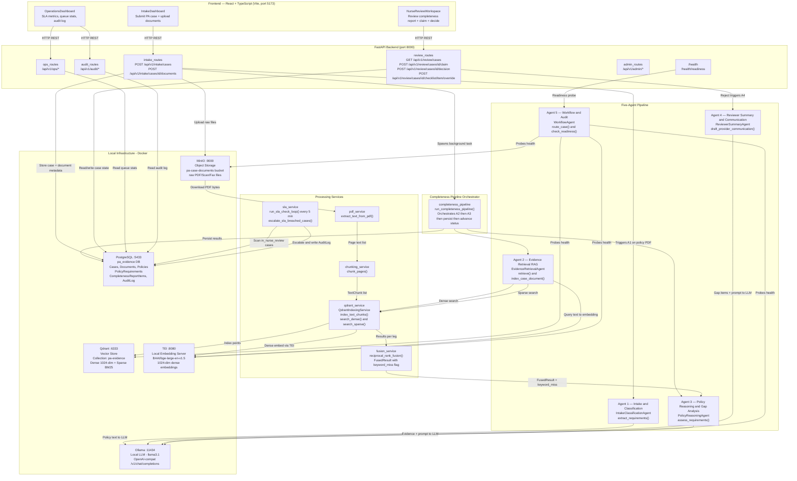
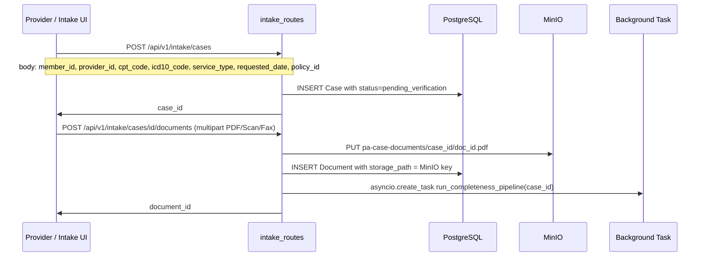
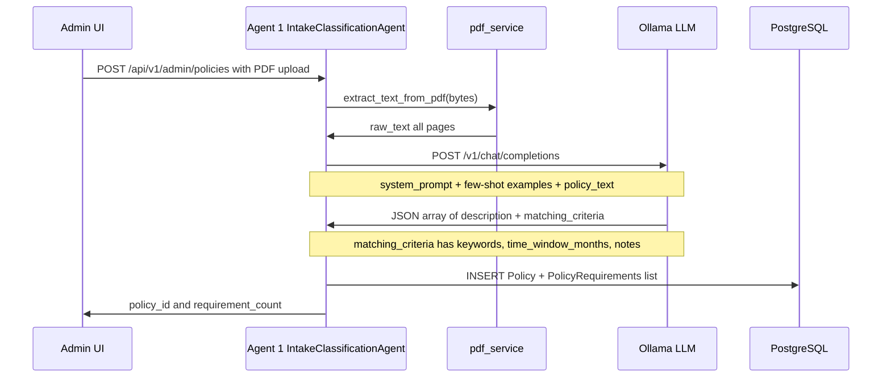
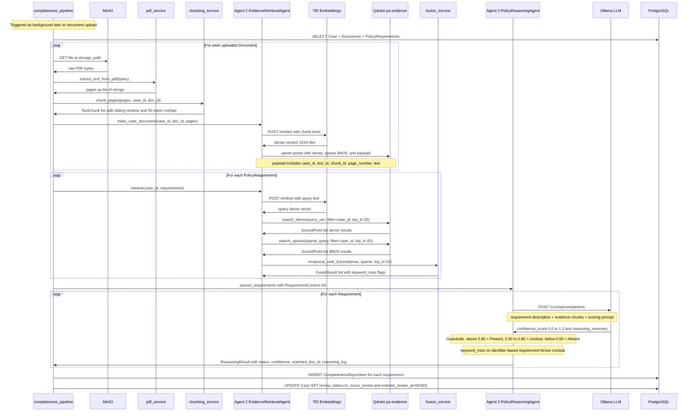
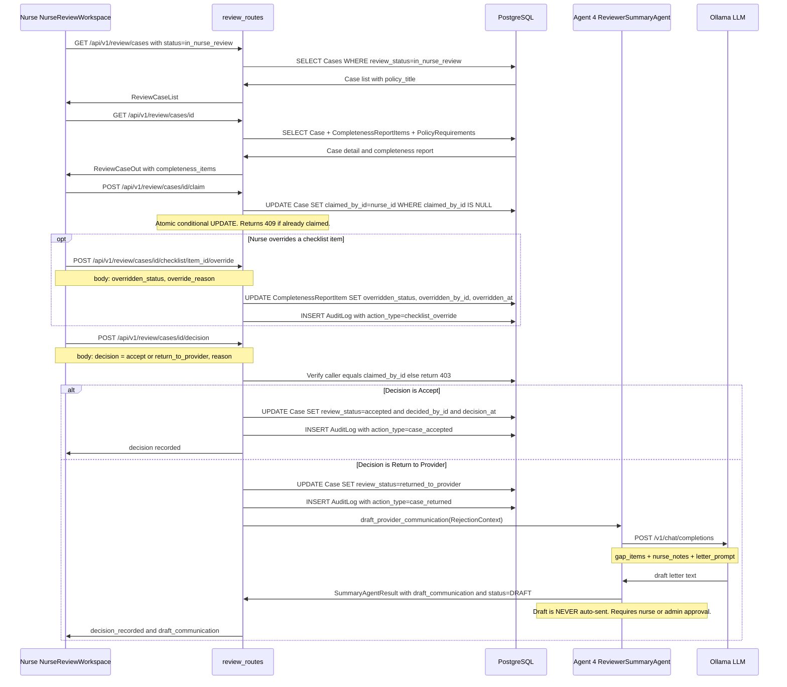
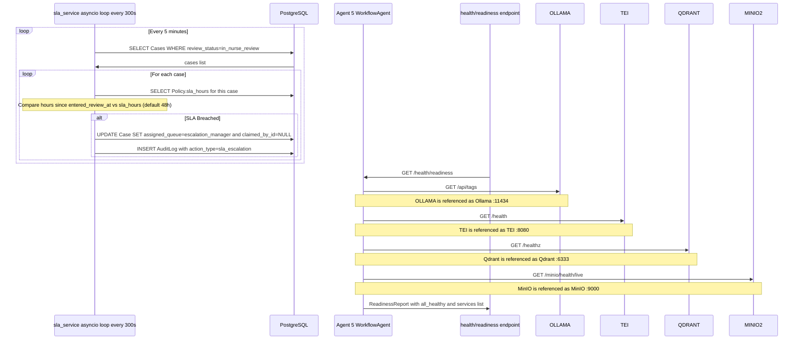
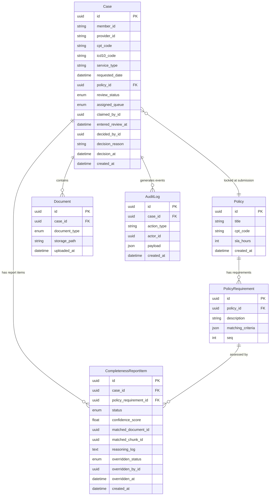
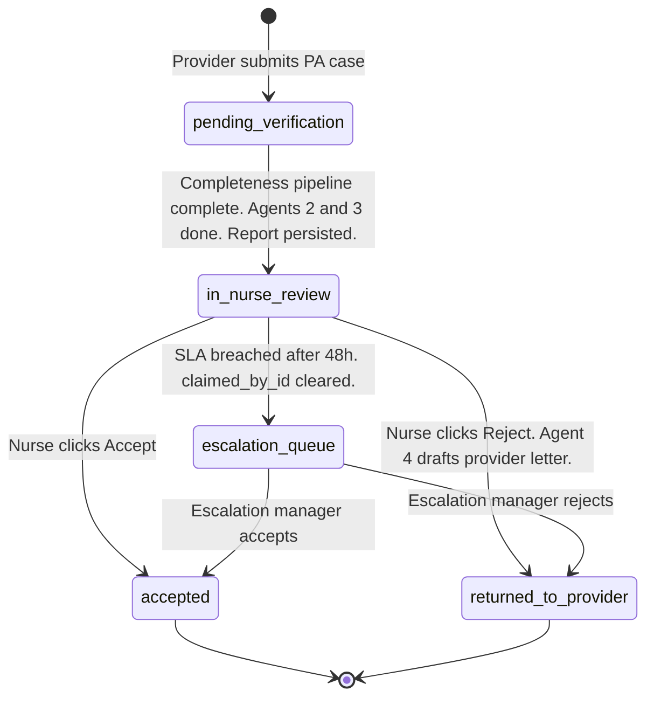

# Elevance Prior Authorization Evidence Assistant — Full Architecture

> **One-page reference** — A complete description of how a PA request flows from provider submission through the five-agent AI pipeline to a nurse's final decision.

---

## High-Level Architecture



---

## Phase 1 — Case Submission



---

## Phase 2 — Policy Intake via Agent 1



---

## Phase 3 — Completeness Pipeline (Agents 2 and 3)



---

## Phase 4 — Nurse Review and Human Decision



---

## Phase 5 — SLA Escalation and Agent 5 Readiness



---

## Data Models (Entity Relationships)



---

## Case Lifecycle State Machine



---

## Qdrant Vector Store — Internal Structure

```
Collection: pa-evidence
│
├── Dense vectors  (name="dense", 1024-dim, Cosine distance)
│   └── Source: TEI server / BAAI/bge-large-en-v1.5
│
├── Sparse vectors (name="sparse", BM25 native Qdrant)
│   └── Use: keyword / identifier exact-match retrieval
│
└── Payload per indexed point:
    ├── case_id       — partitions all queries to current case only
    ├── document_id   — links back to Document ORM row
    ├── chunk_id      — stable UUID for SEC-004 audit citation
    ├── page_number   — shown in nurse UI for source citation
    └── text          — raw chunk text returned with search results
```

---

## Five-Agent Summary

| # | Agent | Class | Calls LLM | Key Input | Key Output |
|---|-------|-------|-----------|-----------|------------|
| 1 | Intake and Classification | `IntakeClassificationAgent` | Ollama | Policy PDF text | `PolicyRequirement[]` with description and matching_criteria |
| 2 | Evidence Retrieval RAG | `EvidenceRetrievalAgent` | TEI embeddings | `RequirementQuery[]` + case_id | `RetrievalAgentResult` — fused chunks with keyword_miss flags |
| 3 | Policy Reasoning and Gap Analysis | `PolicyReasoningAgent` | Ollama | Evidence chunks per requirement | `ReasoningResult[]` — Present / Absent / Unclear + confidence + reasoning_log |
| 4 | Reviewer Summary and Communication | `ReviewerSummaryAgent` | Ollama | Rejection context + gap items | `SummaryAgentResult` — DRAFT letter, never auto-sent |
| 5 | Workflow and Audit | `WorkflowAgent` | None — probes only | Case state | `RoutingDecision` + `ReadinessReport` |

---

## Confidence Threshold Guardrails (Agent 3)

```
LLM confidence score (0.0 to 1.0)
         |
         |-- above 0.80  ----------->  Present   (evidence found)
         |
         |-- 0.50 to 0.80  -------->  Unclear   (forces human nurse review)
         |
         |-- below 0.50  ---------->  Absent    (evidence not found)

SPECIAL RULE — keyword_miss guardrail:
  For identifier-based requirements (member_id, CPT, HCPCS, ICD-10):
  If BM25/keyword search returned NO hit (keyword_miss = True),
  result is forced to Unclear regardless of dense confidence score.

Nurse override:
  Nurse may set overridden_status on any checklist item.
  Original "status" column is NEVER mutated after creation.
  Every override is written to AuditLog (action_type=checklist_override).
```

---

## API Route Map

| Router | Prefix | Key Endpoints | Purpose |
|--------|--------|---------------|---------|
| `intake_routes` | `/api/v1/intake` | `POST /cases`, `POST /cases/{id}/documents` | Case submission and document upload |
| `review_routes` | `/api/v1/review` | `GET /cases`, `GET /cases/{id}`, `POST /cases/{id}/claim`, `POST /cases/{id}/decision`, `POST /cases/{id}/checklist/{item_id}/override` | Nurse review workflow |
| `ops_routes` | `/api/v1/ops` | `GET /dashboard`, `GET /queue-stats` | Operations dashboard data |
| `audit_routes` | `/api/v1/audit` | `GET /cases/{id}/log`, `GET /log` | Audit trail queries |
| `admin_routes` | `/api/v1/admin` | `POST /policies`, `GET /policies` | Policy management — admin only |
| `document_routes` | `/api/v1/documents` | `GET /documents/{id}` | Document retrieval |
| Root | `/health` | `GET /health`, `GET /health/readiness` | Liveness and readiness probes |

---

## Infrastructure Services Map

| Service | Container | Port | Role | Key Constraint |
|---------|-----------|------|------|----------------|
| PostgreSQL 16 | `pa_postgres` | 5433 | Relational store — workflow state, case data, audit log | All state changes go through SQLAlchemy ORM |
| MinIO | `pa_minio` | 9000 / 9001 console | S3-compatible object storage for raw document files | Bucket `pa-case-documents`, no public access |
| Qdrant v1.9.4 | `pa_qdrant` | 6333 HTTP / 6334 gRPC | Vector database — dense + sparse indexes per case | All queries filtered by `case_id` payload |
| Ollama | `pa_ollama` | 11434 | Local open-weight LLM host — llama3.1 default | External URLs blocked by `_is_external_url()` guard |
| TEI HuggingFace | `pa_tei` | 8080 | Local embedding inference — BAAI/bge-large-en-v1.5, 1024-dim | Local only. GPU variant available via image swap |

---

## Constitution Compliance

| Section | Rule | Enforced By |
|---------|------|-------------|
| §I — No Automated Decisions | Agents output Present/Absent/Unclear only. Nurses alone Accept/Reject. | `review_routes` returns 403 if not claimant. `review_status` never auto-set to `accepted`. |
| §II — Local Inference Only | All LLM and embedding calls go to Ollama/TEI on localhost only. | `_is_external_url()` guard in WorkflowAgent. Secrets abstraction for all endpoints. |
| §IV — Full Audit Trail | Every agent action logged. `reasoning_log` stored per completeness item. | `AuditLog` model. `log_audit_event()` called on claim, decision, override, SLA escalation. |
| §V — Secrets Abstraction | No hardcoded URLs or credentials anywhere. | All endpoints via `get_secret()` and `require_secret()` from `core/secrets.py`. |
