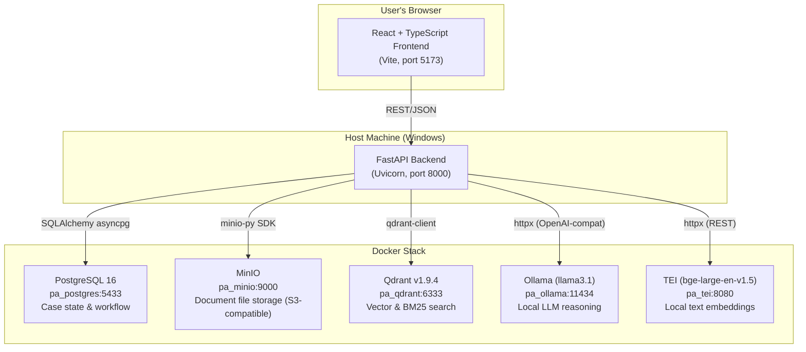

# Elevance Prior Authorization Evidence Assistant — Detailed Architecture

> A fully local, payer-side Prior Authorization (PA) processing system.
> **Core principle (Constitution §II): Zero external API calls — every AI inference runs on your own machine.**

---

## 1. High-Level System Diagram



---

## 2. Infrastructure Layer (Docker Services)

All five services are defined in `docker-compose.yml` and run with persistent Docker volumes.

| Container | Image | Host Port | Purpose |
|---|---|---|---|
| `pa_postgres` | `postgres:16-alpine` | `5433` | Relational DB for case state, workflow, policies, audit logs |
| `pa_minio` | `minio/minio:latest` | `9000` (API), `9001` (Console) | S3-compatible file store for uploaded PDFs/faxes/scans |
| `pa_minio_init` | `minio/mc:latest` | — | One-shot init container that creates the `pa-case-documents` bucket |
| `pa_qdrant` | `qdrant/qdrant:v1.9.4` | `6333` (REST), `6334` (gRPC) | Vector database holding both dense and sparse (BM25) chunk indexes |
| `pa_ollama` | `ollama/ollama:latest` | `11434` | Local LLM server; runs `llama3.1` for all reasoning and intake classification |
| `pa_tei` | `ghcr.io/huggingface/text-embeddings-inference:cpu-latest` | `8080` | Local embedding server running `BAAI/bge-large-en-v1.5` (1024-dim vectors) |

---

## 3. Backend Architecture (FastAPI / Python)

### 3.1 Entry Point — `main.py`

The FastAPI application (`src/main.py`) is the single entry point. On startup, it launches a persistent **SLA background task** as an `asyncio` task via the `lifespan` context manager, and registers all API routers.

```
FastAPI app (v0.3.0)
├── CORS Middleware (allows http://localhost:5173)
├── Lifespan → starts sla_service.run_sla_check_loop() background task
└── Routers:
    ├── /api/v1/intake/*     — Case & document submission
    ├── /api/v1/review/*     — Nurse review workspace
    ├── /api/v1/ops/*        — Operations dashboard (queues, SLA metrics)
    ├── /api/v1/audit/*      — Full audit trail per case
    ├── /api/v1/admin/*      — Policy ingestion (admin-only)
    ├── /api/v1/documents/*  — PDF streaming to the browser
    ├── /health              — Liveness probe
    └── /health/readiness    — Readiness probe (pings all Docker services)
```

### 3.2 Configuration & Secrets — `src/core/`

| File | Purpose |
|---|---|
| `config.py` | Pydantic-settings; reads `.env.local`. Holds all default connection strings (DB URL on port 5433, MinIO endpoint, Qdrant host, Ollama endpoint, TEI endpoint). |
| `secrets.py` | The "secrets abstraction" mandated by Constitution §V. All credentials go through this layer — never direct `os.environ` calls. Supports two backends: `env` (local dev, reads from `config.py`) and `vault` (HashiCorp Vault for production). |
| `database.py` | Creates the single async SQLAlchemy engine (`asyncpg` driver) with `pool_pre_ping=True` for resilience. |

### 3.3 Database Models — `src/models/`

Five SQLAlchemy ORM models backed by PostgreSQL, managed via **Alembic** migrations.

```
policies              ← Uploaded policy documents + SLA hours
  └── policy_requirements  ← Individual evidence requirements extracted by AI
cases                 ← Each Prior Authorization request
  └── documents            ← Uploaded evidence PDFs (stored in MinIO)
  └── completeness_report_items  ← Per-requirement AI verdict (Present/Unclear/Absent)
audit_logs            ← Immutable event trail (every status change, AI call, decision)
```

**Key Case workflow states** (`ReviewStatus` enum):
- `pending_verification` — Pipeline is running (or failed/stalled)
- `in_nurse_review` — AI pipeline complete; assigned to nurse queue
- `accepted` — Nurse approved
- `returned_to_provider` — Nurse rejected (no "denied" — just returned for more docs)

**Queue routing** (`AssignedQueue` enum):
- `nurse_review` — Normal flow
- `escalation_manager` — SLA breach escalation
- `medical_director_review` — Override cases

---

## 4. The Five-Agent Architecture

The system is built around five specialized Python agents. Each agent is a stateless singleton class that communicates only with local endpoints.

### Agent 1 — `IntakeClassificationAgent` (`intake_agent.py`)

**Trigger:** Admin uploads a policy PDF via `/api/v1/admin/`.

**Responsibilities:**
1. Receives the policy PDF text (extracted by `pdf_service.py` using **PyMuPDF/pdfminer**).
2. Sends the text to **Ollama** via its OpenAI-compatible `/v1/chat/completions` endpoint using a **few-shot prompt**.
3. Ollama reads the policy and returns a JSON array of `PolicyRequirement` objects — each with a plain-English description and `matching_criteria` (keywords, time windows).
4. The requirements are persisted to `policy_requirements` in PostgreSQL.

**Key design:** Uses a few-shot example (MRI Lumbar Spine policy) to guide the LLM to produce consistent, parseable JSON.

---

### Agent 2 — Retrieval Agent (`retrieval_agent.py`)

**Trigger:** Called internally by the Completeness Pipeline for each policy requirement.

**Responsibilities:**
1. Receives a `RequirementDescription` string.
2. Calls **Qdrant** twice (via `qdrant_service.py`):
   - **Dense search:** Semantic similarity using 1024-dim vectors from TEI (`search_dense`)
   - **Sparse search:** BM25 keyword search using Qdrant's native sparse vector index (`search_sparse`)
3. Returns top-10 candidates from each search to the fusion layer.

---

### Service — Qdrant Service (`qdrant_service.py`)

Manages the single Qdrant collection `pa-evidence`. Each vector point carries payload fields: `case_id`, `document_id`, `chunk_id`, `page_number`, `text`. All searches are filtered by `case_id` so results are never cross-contaminated between cases.

To create embeddings, the service calls the **local TEI server** (`http://localhost:8080/embed`) via `httpx`.

---

### Service — Fusion Service (`fusion_service.py`)

Combines the two result lists from the Retrieval Agent using **Reciprocal Rank Fusion (RRF)** — a well-known information retrieval algorithm (Cormack et al., 2009):

```
RRF(chunk) = 1 / (60 + dense_rank) + 1 / (60 + sparse_rank)
```

After fusion, top-5 chunks are passed to the Reasoning Agent. The fusion service also flags `keyword_miss=True` if a chunk has a strong semantic (dense) score but **no** BM25 keyword match — which is important for precise identifier-based requirements.

---

### Agent 3 — `PolicyReasoningAgent` (`reasoning_agent.py`)

**Trigger:** Called by the Completeness Pipeline after retrieval and fusion are complete.

**Responsibilities:**
1. Receives the policy requirement description + the top-5 fused evidence chunks.
2. Calls **Ollama** with a structured prompt asking it to determine if the evidence satisfies the requirement.
3. Ollama returns a JSON response with `status` (Present/Absent/Unclear), `confidence_score` (0.0–1.0), and a `reasoning_log`.
4. Enforces confidence threshold guardrails:
   - `confidence > 0.80` → **Present**
   - `0.50 ≤ confidence ≤ 0.80` → **Unclear** (forces human review)
   - `confidence < 0.50` → **Absent**
   - **Special rule:** If `keyword_miss=True` on an identifier-based requirement (Member ID, CPT, ICD-10), the status is capped at **Unclear** regardless of confidence.
5. Results map 1:1 to `CompletenessReportItem` rows in PostgreSQL.

**Resilience:** The agent has a warm-up call on first load and retries up to 3 times with 30-second backoff on `ReadTimeout` or `HTTP 5xx` errors. Timeout is currently set to **900 seconds** to handle large document contexts.

---

### Agent 4 — `SummaryAgent` (`summary_agent.py`)

Generates a human-readable summary of the completeness report for the nurse to review quickly without reading every detail.

---

### Agent 5 — `WorkflowAgent` (`workflow_agent.py`)

**Responsibilities:**
1. **Case routing:** Determines the next workflow state for a case.
2. **Deployment readiness:** Probes all local Docker services (Ollama, TEI, Qdrant, MinIO) and returns a structured health report for `/health/readiness`.

---

## 5. The Core Pipeline — `completeness_pipeline.py`

The pipeline is the orchestrator that ties agents 1–3 together. It runs as a **fire-and-forget `asyncio` background task** — meaning the HTTP response for case creation returns immediately to the user, and the pipeline runs silently in the background.

```
run_completeness_pipeline(case_id)
│
├── 1. Load Case + PolicyRequirements from PostgreSQL
│
├── 2. For each Document in the Case:
│   ├── Download PDF bytes from MinIO
│   ├── Extract text (pdf_service → PyMuPDF)
│   ├── Split into pages
│   ├── Chunk pages (chunking_service → 512-token chunks, 50-token overlap)
│   └── Index all chunks into Qdrant (via TEI embeddings + BM25)
│
├── 3. For each PolicyRequirement:
│   ├── Dense search Qdrant → top 10
│   ├── Sparse (BM25) search Qdrant → top 10
│   ├── RRF fusion → top 5 evidence chunks
│   └── Call ReasoningAgent → ReasoningResult (Present/Absent/Unclear)
│
├── 4. Persist all CompletenessReportItems to PostgreSQL
│
└── 5. Advance Case.review_status → in_nurse_review
```

---

## 6. SLA Escalation Service — `sla_service.py`

A background asyncio task that wakes up every **5 minutes** and scans all cases with `in_nurse_review` status. If `now - case.entered_review_at > policy.sla_hours` (default: 48 hours), it:
1. Sets `case.assigned_queue → escalation_manager`
2. Clears `case.claimed_by_id` (removes from nurse's personal queue)
3. Writes an `AuditLog` row with `action_type = sla_escalation`

---

## 7. Chunking Strategy — `chunking_service.py`

A fully custom, zero-dependency text splitter (no LangChain/LlamaIndex):

- **Algorithm:** Sentence-based. Sentences are split on `.`, `!`, `?`, or double-newlines using a `re` regex.
- **Chunk size:** ~512 tokens (approximated as 4 chars/token → 2048 chars).
- **Overlap:** 50 tokens (200 chars) carried over between chunks.
- **Cross-page overlap:** The tail of the last chunk on Page N is seeded into the first chunk of Page N+1, so evidence spanning a page break is not lost.
- **Metadata per chunk:** `case_id`, `document_id`, `chunk_id` (UUID), `page_number`.

---

## 8. Frontend Architecture (React / TypeScript / Vite)

Three pages, each with dedicated CSS:

| Page | Route | Purpose |
|---|---|---|
| `IntakeDashboard.tsx` | `/intake` | Submit new PA cases; upload PDFs; track submission status |
| `NurseReviewWorkspace.tsx` | `/review` | Main clinical workspace; view AI completeness report with PDF viewer side-by-side; Accept or Return case |
| `OperationsDashboard.tsx` | `/ops` | Queue volumes, SLA breach alerts, case search by CPT code, system health metrics |

All API calls are centralized in `src/services/api.ts` which points to `http://localhost:8000`.

---

## 9. Data Flow Summary

```
Provider submits PA request
        ↓
[ IntakeDashboard ] → POST /api/v1/intake/cases
        ↓
[ Backend ] saves Case to PostgreSQL, saves PDFs to MinIO
        ↓ (background task, user gets 202 response immediately)
[ Completeness Pipeline ]
  → Download PDFs from MinIO
  → Extract text (PyMuPDF)
  → Chunk (512 tokens, 50 overlap)
  → Embed (TEI / bge-large-en-v1.5) + Index (Qdrant)
  → For each policy requirement:
      → Retrieve (Qdrant dense + sparse) → Fuse (RRF)
      → Reason (Ollama llama3.1) → Present / Absent / Unclear
  → Save CompletenessReportItems to PostgreSQL
  → Advance Case to in_nurse_review
        ↓
[ NurseReviewWorkspace ] ← GET /api/v1/review/cases
  → Nurse sees AI verdict per requirement
  → Nurse streams the PDF from MinIO via /api/v1/documents/{id}/stream
  → Nurse clicks Accept or Return → PATCH /api/v1/review/cases/{id}/decision
        ↓
[ SLA Background Task ] (every 5 min)
  → Escalate if nurse hasn't decided within SLA window
```
